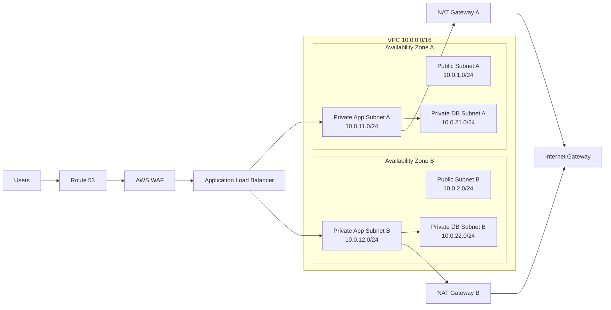

# Packet Tracer Network Design

This file explains the networking part of the project in a simple way and shows how the AWS design can be represented in Packet Tracer.

## What this part does

The networking part is responsible for:

- separating the public and private networks
- keeping the application and database layers isolated
- giving the application servers controlled internet access through NAT
- blocking direct access to the private servers from the internet
- making the setup redundant across two availability zones

## Simple map

## AWS to Packet Tracer mapping

| AWS item | Packet Tracer idea | Why it matters |
|---|---|---|
| VPC | Main internal network | This is the whole private environment |
| Public subnet | Network that can reach the internet | Used for NAT and public-facing parts |
| Private app subnet | App server LAN | Keeps application servers hidden |
| Private DB subnet | Database LAN | Keeps database servers even more protected |
| Internet Gateway | Edge router to the internet | Gives the public side internet access |
| NAT Gateway | NAT router | Lets private app servers go out, but not come in |
| Route table | Routing table / static routes | Tells traffic where to go next |

## IP plan

| Segment | CIDR | Example gateway |
|---|---|---|
| Public A | 10.0.1.0/24 | 10.0.1.1 |
| Public B | 10.0.2.0/24 | 10.0.2.1 |
| App A | 10.0.11.0/24 | 10.0.11.1 |
| App B | 10.0.12.0/24 | 10.0.12.1 |
| DB A | 10.0.21.0/24 | 10.0.21.1 |
| DB B | 10.0.22.0/24 | 10.0.22.1 |

## Traffic rules

- Users can reach the application only through HTTPS/HTTP.
- Application servers can reach the database only on PostgreSQL port 5432.
- Application servers can go out to the internet through NAT.
- The internet cannot connect directly to the application or database servers.
- Database servers stay private and do not talk to the internet.

## What to build in Packet Tracer

1. Put one edge device that represents the internet side.
2. Put two routers that act like NAT Gateway A and NAT Gateway B.
3. Put one switch for each availability zone.
4. Put one application server and one database server in each zone.
5. Separate the app and database sides with different subnets or VLANs.
6. Add routing so the app side uses the correct NAT router.
7. Add simple filtering rules so only the needed traffic is allowed.

## One-line summary

This part is basically a controlled neighborhood: the app servers are reachable, the databases stay hidden, and the whole design still keeps working even if one zone has a problem.
